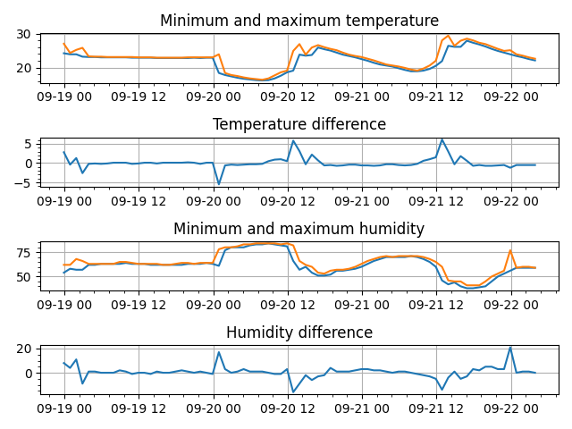
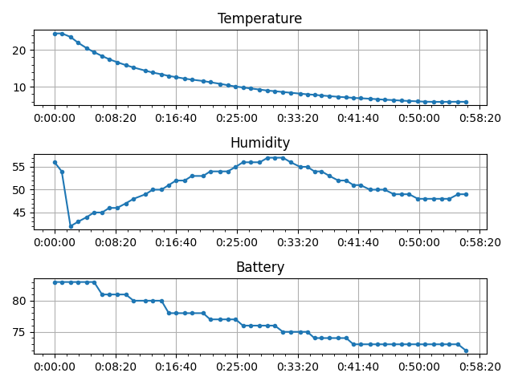

# lywsd03mmc-access

Access *Xiaomi Mi Temperature and Humidity Monitor 2* (*LYWSD03MMC*) device.


## Features

Some features of the project:
- reading current measurement,
- reading history data,
- storing history data to JSON,
- plotting history data.

Example of history chart:



## Device

*Xiaomi Mi Temperature and Humidity Monitor 2* is nice and cheap temperature and humidity sensor that allows to read 
measurements remotely through *Bluetooth*. Device has very useful feature related to remote read: it is 
able to store history of measurements.

Every history entry consists of: 
- entry index,
- entry timestamp,
- maximum and minimum tempreature,
- maximum and minimum humidity.

Min and max values are designated in the range on one hour, so history of two full days consists of 48 entries. 
Unfortunately it is impossible to change given range of one hour. Device is capable to store at least **300** history 
entries.


#### Battery consumption

Manufacturer claims that it works up to one year on battery. It becomes clear that it does not involve BT connections.

###### Subscription

Following listing presents measurements log in *subscription* mode:

```
received data: 2025-09-19 18:49:33.882839 Temp: 22.95C Humidity: 63% Battery: 89%
received data: 2025-09-19 18:49:39.915296 Temp: 22.94C Humidity: 63% Battery: 89%
received data: 2025-09-19 18:49:45.945374 Temp: 22.94C Humidity: 63% Battery: 89%
...
received data: 2025-09-19 19:09:02.709446 Temp: 22.98C Humidity: 63% Battery: 84%
received data: 2025-09-19 19:09:08.739266 Temp: 23.01C Humidity: 63% Battery: 84%
``` 
Full log is accessible [here](examples/data_subscribe.txt).

There are 195 samples in time span of 19 minutes and 35 seconds. Time step between each sample is 6 seconds (unable 
to change). Battery drop is ~5%pt, so:
- battery consumption is ~**15.3%pt per hour**,
- battery consumption is **0.026%pt per sample**.

###### Polling

Following listing presents measurements log in polling mode:

```
[2025-09-19 01:11:57.829490] Temp: 25.16C Humidity: 58% Battery: 97%
[2025-09-19 01:32:07.809542] Temp: 23.61C Humidity: 61% Battery: 96%
[2025-09-19 01:52:15.276131] Temp: 23.36C Humidity: 62% Battery: 96%
...
[2025-09-19 14:39:02.402049] Temp: 22.88C Humidity: 62% Battery: 92%
[2025-09-19 14:59:13.925522] Temp: 22.91C Humidity: 62% Battery: 91%

``` 
Full log is accessible [here](examples/data_poll.txt).

There are 42 samples in time span of 13 hours, 47 minutes and 16 seconds. Time step between each sample is 20 minutes 
(can be any duration). Battery drop is ~6%pt, so:
- battery consumption is ~**0.44%pt per hour**,
- battery consumption is **0.14%pt per sample**.

It becomes clear that active polling consumes more energy than receiving notification. On other hand normally there is 
no need to measure temperature every 6 seconds. Active polling to be less efficient than notifications has to be 
performed with period shorter than **30 seconds**.

#### Humidity accuracy

In some places in the web it is mentioned that humidity sensor can be somehow inaccurate. For some devices it can be 
about 5 percentage points higher than real value.

Further information can be found here:
- https://www.rotronic.com/media/productattachments/files/c/a/capacitive_humidity_sensor_final.pdf
- https://www.reddit.com/r/Xiaomi/comments/yv565e/comment/jd4s3qd/
- https://github.com/Zenedith/LYWSD03MMC?tab=readme-ov-file#calibration

#### Sensor inertia - warming

For inertia estimation following experiment was taken: sensor was placed inside a fridge (~7C) for long time (~24h) to 
achieve stability. Then it was taken out to warm room (~24C) and observed until sensor reached stable state.

Temperature and humidity measurements for period reaching stability in warm room is shown in following chart:


Full log is accessible [here](examples/fridge_out_measurements.txt).

Sensor was taken out from fridge just after second measurement. Stability is reached roughly after **30 minutes**. 
Humidity chart shows initial rise probably because of vapor condensation on the sensor (*dew point* at 
temperature ~24C and humidity ~60% is ~16C).

#### Sensor inertia - cooling

Similar experiment was taken for inertia estimation in case of cooling: sensor was taken from warm room (~24C) to fridge 
(~6C) and observed until sensor reaches stability.

Temperature and humidity measurements in fridge is shown in following chart:



Full log is accessible [here](examples/fridge_in_measurements.txt).

Sensor was put into fridge just after second measurement. Target temperature is reached rougly after **60 minutes**.
On humidity chart there is sudden value drop and then curve takes sinusoidal shape.

#### Sensor stability

Sensor stability is presented on following charts:

- measurement stability in warm environment


- measurement stability in cold environment


Charts data can be found [here (warm)](examples/outdoor_stability.json) and   
[here (cold)](examples/cold_stability.json).

First chart presents measurement history of senor placed in warm room (~24.5C). Second chart presents temperature and
humidity history in fridge (~7C). Measurement period for first case is 10 hours and for second case is 7 hours. In 
case of warm room min and max temperature difference is around **0.5C**, and humidity around **2%pt**. Inside fridge 
temperature difference is **2.5C** and humidity difference equals to **14%pt**.

Charts presents that sensor oscillations are smaller in warm temperatures than in cold temperatures.

Those results can be compared to chart presenting sensor measurements in outdoor environment:


Chart data is stored [here (outdoor)](examples/outdoor_stability.json).

Despite temperature changes between day and night, temperature variance is smaller than measurements in fridge.


## Running the application

Application accepts following arguments:

<!-- insertstart include="doc/cmdargs.txt" pre="\n" post="\n" -->
```
usage: python3 -m lywsd03mmcaccess.main [-h] [-la] [-nl] [--listtools]
                                        {info,readdata,readhistory,printhistory,convertmeasurements}
                                        ...

access Xiaomi Mi Temperature and Humidity Monitor 2 (LYWSD03MMC) device

options:
  -h, --help            show this help message and exit
  -la, --logall         Log all messages (default: False)
  -nl, --nolog          No diagnostics log messages (default: False)
  --listtools           List tools (default: False)

subcommands:
  commands

  {info,readdata,readhistory,printhistory,convertmeasurements}
                        commands
    info                read device basic data
    readdata            read current measurement
    readhistory         read history
    printhistory        print data file (history or measurements)
    convertmeasurements
                        convert measurements list to JSON
```


```
usage: python3 -m lywsd03mmcaccess.main info [-h] --mac MAC

read device basic data

options:
  -h, --help  show this help message and exit
  --mac MAC   MAC address of device (default: None)
```


```
usage: python3 -m lywsd03mmcaccess.main readdata [-h] --mac MAC

read current measurement

options:
  -h, --help  show this help message and exit
  --mac MAC   MAC address of device (default: None)
```


```
usage: python3 -m lywsd03mmcaccess.main readhistory [-h] --mac MAC
                                                    [--recent RECENT]
                                                    [--outappend OUTAPPEND]

read history

options:
  -h, --help            show this help message and exit
  --mac MAC             MAC address of device (default: None)
  --recent RECENT       Number of recent entries (default: None)
  --outappend OUTAPPEND
                        Path to output JSON file to append history data
                        (default: None)
```


```
usage: python3 -m lywsd03mmcaccess.main printhistory [-h] --infile INFILE
                                                     [--recent RECENT]
                                                     [--noprint] [--showchart]
                                                     [--outchart OUTCHART]

print data file (history or measurements)

options:
  -h, --help           show this help message and exit
  --infile INFILE      Path to JSON file with data (default: None)
  --recent RECENT      Number of recent entries (default: None)
  --noprint            Do not print raw data (default: False)
  --showchart          Show data chart (default: False)
  --outchart OUTCHART  Print data in form of chart (default: None)
```


```
usage: python3 -m lywsd03mmcaccess.main convertmeasurements
       [-h] --infile INFILE [--outfile OUTFILE] [--noprint]

convert measurements list to JSON

options:
  -h, --help         show this help message and exit
  --infile INFILE    Path to measurements file (default: None)
  --outfile OUTFILE  Path to output JSON (default: None)
  --noprint          Do not print raw data (default: False)
```

<!-- insertend -->

#### Collecting history

Measurements history can be collected to JSON file using following command:

```python3 -m lywsd03mmcaccess readhistory --mac <address> --outappend <path-to-JSON-file>```

Command will read history file, check recent measurement, get new measurements from device and add them to the file.
This feature is handy when executed eg. from cron scheduler. Command, depending on needs, could be executed once a 
day or twice a week.


## Installation

Installation of package can be done by:
 - to install package from downloaded ZIP file execute: `pip3 install --user -I file:lywsd03mmc-access-master.zip#subdirectory=src`
 - to install package directly from GitHub execute: `pip3 install --user -I git+https://github.com/anetczuk/lywsd03mmc-access.git#subdirectory=src`
 - uninstall: `pip3 uninstall lywsd03mmcaccess`

Installation for development:
 - `install-deps.sh` to install package dependencies only (`requirements.txt`)
 - `install-package.sh` to install package in standard way through `pip` (with dependencies)
 - `install-devel.sh` to install package in developer mode using `pip` (with dependencies)


## Development

All tests, linters and content generators can be executed by simple script `./process-all.sh`.

Unit tests are executed by `./src/testlywsd03mmcaccess/runtests.py`.

Code linters can be run by `./tools/checkall.sh`.

In case of pull requests please run `process-all.sh` before the request.


## References

- https://github.com/uduncanu/lywsd03mmc
- Python `struct` format string: https://docs.python.org/3/library/struct.html#format-strings


## License

```
BSD 3-Clause License

Copyright (c) 2025, Arkadiusz Netczuk <dev.arnet@gmail.com>

Redistribution and use in source and binary forms, with or without
modification, are permitted provided that the following conditions are met:

1. Redistributions of source code must retain the above copyright notice, this
   list of conditions and the following disclaimer.

2. Redistributions in binary form must reproduce the above copyright notice,
   this list of conditions and the following disclaimer in the documentation
   and/or other materials provided with the distribution.

3. Neither the name of the copyright holder nor the names of its
   contributors may be used to endorse or promote products derived from
   this software without specific prior written permission.

THIS SOFTWARE IS PROVIDED BY THE COPYRIGHT HOLDERS AND CONTRIBUTORS "AS IS"
AND ANY EXPRESS OR IMPLIED WARRANTIES, INCLUDING, BUT NOT LIMITED TO, THE
IMPLIED WARRANTIES OF MERCHANTABILITY AND FITNESS FOR A PARTICULAR PURPOSE ARE
DISCLAIMED. IN NO EVENT SHALL THE COPYRIGHT HOLDER OR CONTRIBUTORS BE LIABLE
FOR ANY DIRECT, INDIRECT, INCIDENTAL, SPECIAL, EXEMPLARY, OR CONSEQUENTIAL
DAMAGES (INCLUDING, BUT NOT LIMITED TO, PROCUREMENT OF SUBSTITUTE GOODS OR
SERVICES; LOSS OF USE, DATA, OR PROFITS; OR BUSINESS INTERRUPTION) HOWEVER
CAUSED AND ON ANY THEORY OF LIABILITY, WHETHER IN CONTRACT, STRICT LIABILITY,
OR TORT (INCLUDING NEGLIGENCE OR OTHERWISE) ARISING IN ANY WAY OUT OF THE USE
OF THIS SOFTWARE, EVEN IF ADVISED OF THE POSSIBILITY OF SUCH DAMAGE.
```
